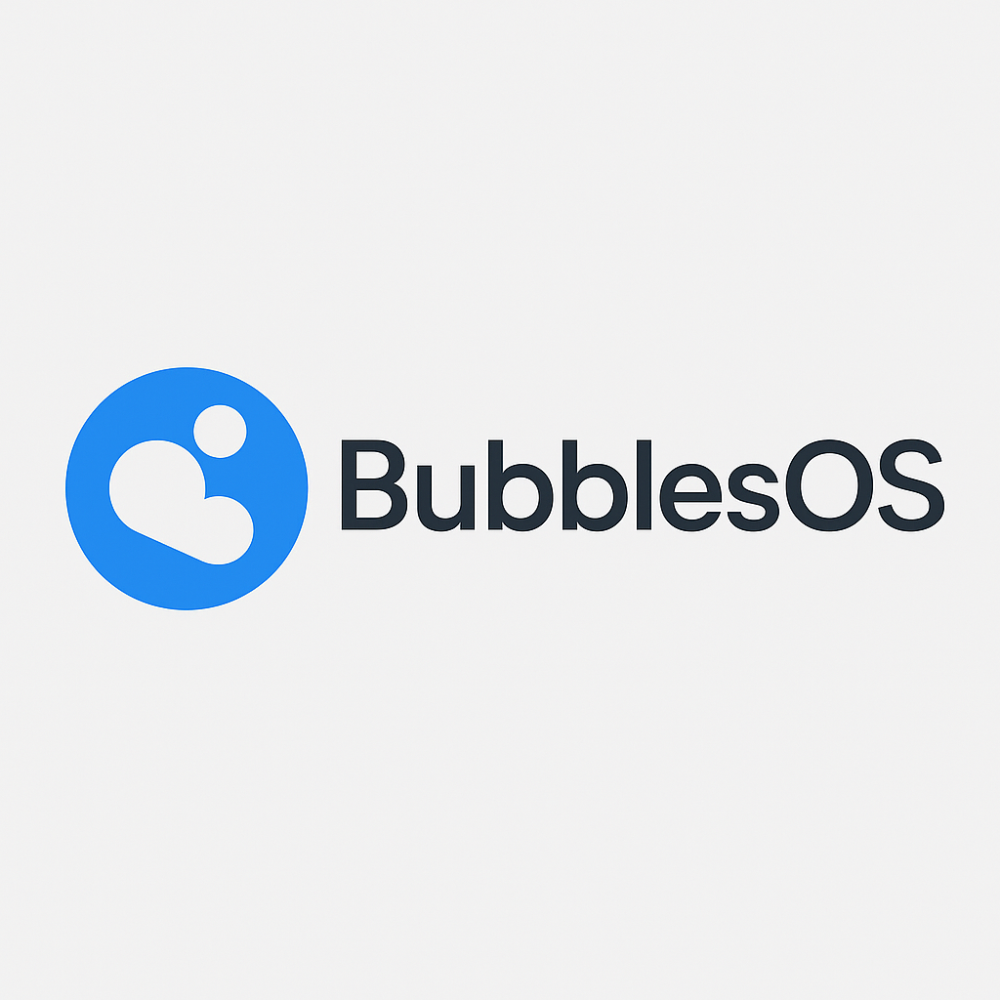

**ISO being tested!**

*Bubbles OS is distributed as a ready-to-use ISO file. Just boot and install—no building required.*

  
  
  
  
  
  
  
  
  
  

	

# Bubbles OS

Bubbles OS is your gateway to a safer, smarter, and more enjoyable Linux experience. Built for everyone—including privacy enthusiasts, families, students, professionals, and those with accessibility needs—Bubbles OS combines powerful security with a beautiful, user-friendly, and accessible desktop. Whether you want a secure system for work, learning, gaming, or everyday use, Bubbles OS is designed to be simple, flexible, and ready for anything.

**Why choose Bubbles OS?**

## Technical Highlights

- **Full Disk Encryption:** All your files are protected and private.
- **Advanced Security:** Strong access controls, SELinux, AppArmor, and a hardened firewall keep you safe online.
- **Privacy by Default:** Minimal system footprint and disabled unnecessary services.
- **Automatic Updates:** Security patches and system updates are handled for you.
- **Custom Branding:** Personalize your desktop with themes, logos, and wallpapers.
- **Easy Setup:** Choose your own username and password during installation.
- **Multiple Desktop Environments:** KDE, XFCE, and MATE for a flexible, customizable experience.
- **Games & Educational Software:** Fun and learning for all ages, included by default.
- **Language Packs & Fonts:** Multilingual support and extra fonts for global accessibility.
- **Accessibility Features:**
    - Screen reader support (Orca)
    - On-screen keyboard (Onboard)
    - High-contrast and large-text themes
    - Magnifier/zoom tools
    - Keyboard navigation and shortcuts
    - Accessible installer prompts

**Perfect for:**
- Home users who want privacy and safety
- Students, professionals, and remote workers
- Families and kids who want games and educational software
- Security learners and ethical hackers
- Tech enthusiasts who want multiple desktop environments
- Anyone switching from Windows or Mac

---

## Minimum System Requirements

- 64-bit CPU, 1 GHz or faster (Intel Core i3, AMD equivalent, or better)
- 2 GB RAM (4 GB or more recommended for best performance)
- 20 GB free disk space (more if you plan to install extra apps or store lots of files)
- Intel HD Graphics or any integrated GPU (dedicated graphics optional)
- Internet connection (required for first boot setup and automatic application installation)

## What’s Inside?

Bubbles OS comes packed with everything you need for work, play, learning, and security:

- **Popular Applications:** Rhythmbox, VS Code, Discord, Brave Browser, VLC, LibreOffice, Audacity, Thunderbird, Timeshift, Synaptic, Htop, BleachBit, K3b, GNOME Tweaks, Stacer, PlayOnLinux, Wine, and more.
- **Games & Educational Software:** SuperTux, SuperTuxKart, TuxMath, TuxType, GCompris, Minetest, and more for fun and learning.
- **Multiple Desktop Environments:** KDE, XFCE, MATE—choose your favorite look and workflow.
- **Security & Penetration Testing Tools:** nmap, netcat, aircrack-ng, hydra, john, nikto, sqlmap, whois, dnsutils, tcpdump, hashcat, binwalk, gobuster, wfuzz, enum4linux.
- **Privacy & Protection:** Full disk encryption, SELinux, AppArmor, aggressive firewall, intrusion detection, and automatic security updates.
- **Custom Branding:** Personalize your desktop with themes, logos, and wallpapers.
- **Language Packs & Fonts:** Multilingual support and extra fonts for global accessibility.
- **Easy Updates & Maintenance:** Simple scripts keep your system secure and up to date.
- **Extra Documentation & Tutorials:** Helpful guides and resources for new and advanced users.

## User Experience

Bubbles OS is designed to be intuitive and welcoming for everyone. The installer guides you through setup, letting you choose your username and password. After installation, you’ll enjoy a clean, modern desktop with all your favorite tools ready to go. Browse the web, edit documents, play games, or explore cybersecurity—Bubbles OS is ready for work and play.

## Who is Bubbles OS for?

- Everyday users who want a secure, hassle-free Linux desktop
- Students, professionals, and remote workers
- Families and kids who want games and educational software
- Privacy advocates and security learners
- Tech enthusiasts who want multiple desktop environments
- Anyone looking for a fast, reliable alternative to Windows or Mac

## Support & Community

Need help or want to get involved? Check out the documentation, join the Bubbles OS community, or contribute to the project. Your feedback and ideas help make Bubbles OS even better!

---

Just start up Bubbles OS and enjoy a secure, modern Linux—no advanced knowledge required. Bubbles OS: Security made simple, freedom made easy.
